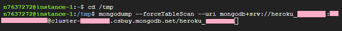

## Heroku is gone! Can I still get my data?  
[xDrip](../../README.md) >> [Features](../Features_page) >> [Nightscout](../Nightscout_page) >> [Nightscout on Google Cloud](./GoogleCloud) >> Import data from Atlas  
  
Even though Heroku is not free any longer, you can still transfer your database for free as it is on Atlas and not Heroku.  This page explains how to do it.  
In order to transfer a database from Atlas, you need to have already completed Nightscout [installation](./NS_Install.md).  
  
Open a [terminal](./Terminal.md).  Exit the menu.  Enter the following into the terminal.  
  
<mark style="background-color: #eFdFef">cd /tmp </mark>    
  
You will need the email address and password you used when you signed up for Atlas.  We all had to do this in 2020.  
Go to [mongodb](https://www.mongodb.com/home) and sign in.  
  
In the left pane, click on Database Access.
  
You will be taken to the Database Access page.  Take note of the user name (enclosed in orange in the following image).  You will need it later.  
  
On the right, click on "Edit".  
  
You will be taken to the page shown below.  
  
If you don't remember the password (this is not the password you use to log into Atlas) or if your password contains special characters, click on Edit Password and change the password.  Take note of the password because you will need it later.  
  
In the left pane, click on "Database" to go back to the main page.  Click on the 3-dot menu button and click on "Command Line Tools" as shown in the following image.  
  
  
Under "Binary Import and Export Tools", copy the mongodump string.  You can do that by clicking on the copy symbol on the right side of the sring, as marked in the image below.  
  
  
Paste the mongodump string you copied into the terminal.  
  
Replace \<PASSWORD\> with your Atlas database admin password, which excludes special characters.  Replace \<DATABASE\> with the user name you copied from the Atlas database access page.  Insert --forceTableScan right after mongodump.  What you have in the terminal should now look like the following.  
  
Enter.  
  
Wait for the export process to complete.  It could take a few minutes.  
Now, enter the following in the terminal replacing UserName with the user name you copied from the Atlas database access page.  
  
<mark style="background-color: #eFdFef">mongorestore -d Nightscout ./dump/UserName </mark>  
  
Wait a minute.  Reload Nightscout in a browser.  Your imported data from Atlas should be present now.  
  
