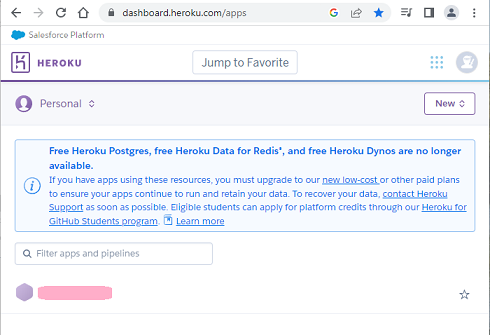
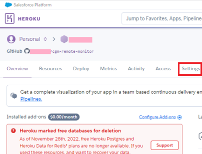
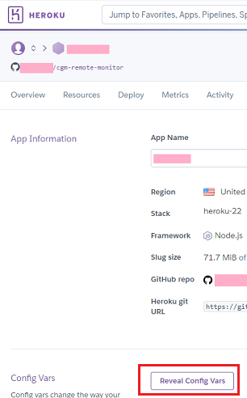
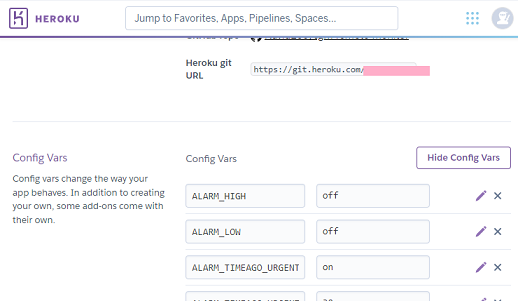

## Heroku Variables
[Google Cloud Nightscout](./GoogleCloud.md) >> Heroku Variables  
  
If Nightscout worked for you on Heroku and now you have problems, you can log into Heroku to access the variables you had.  They may help.  What you need is your email address and password you used to log into Heroku.  If you enabled multi-factor authentication on Heroku, you will also need an authenticator app.  
  
Go to [Heroku](https://www.heroku.com/).  Log in.  Click on the name of your app below.  
  
  
That will take you to your project.  Click on "Settings".  
   
  
You will be taken to the variables page.  Click on "Reveal Config Vars at the bottom".  
  
  
Scroll down to see the revealed variables.  
  
  
It may not be a good idea to copy every variable from Heroku to Google Cloud.  For example, the variable that sets up MongoDB, on Heroku, sets it up on Atlas.  You don't need a Nightscout variable on Google Cloud to set up Mongo DB on the virtual machine.  That is done for you by default when you install.  
  
But, it's always a good idea to have a look at your old variables.   They may help you realize what you may have set up incorrectly now.  
  
