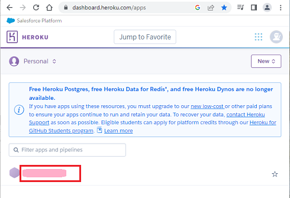

## Heroku Variables
[xDrip](../../README.md) >> [Features](../Features_page) >> [Nightscout](../Nightscout_page) >> [Nightscout on Google Cloud](./GoogleCloud) >> Heroku Variables  
  
If Nightscout worked for you on Heroku and now you have problems, you can log into Heroku to access the variables you had.  They may help.  What you need is your email address and password you used to log into Heroku.  If you enabled multi-factor authentication on Heroku, you will also need n authernticator app.  
  
Go to [Heroku](https://www.heroku.com/).  Log in.  Click on the name of your app below.  
  
  
That will take you to your project.  Click on "Settings".  
   
  
You will be taken to the variables page.  Click on "Reveal Config Vars at the bottom".  
  
  
Scroll down to see the revealed variables.  
  
  
