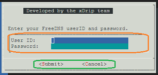

## How to use menus
[xDrip](../../README.md) >> [Features](../Features_page) >> [Nightscout](../Nightscout_page) >> [Nightscout on Google Cloud](./GoogleCloud) >> How to use menus  
  
Menus are used so that you can accomplish everything you need without having to deal with Linux command entry.  The following shows one of the menus.  
  
