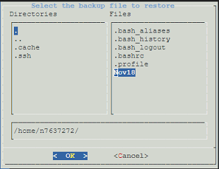
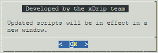

## How to use menus
[xDrip](../../README.md) >> [Features](../Features_page) >> [Nightscout](../Nightscout_page) >> [Nightscout on Google Cloud](./GoogleCloud) >> How to use menus  
  
Menus are used so that you can accomplish everything you need without having to deal with Linux command entry.  The following shows one of the menus.  
  
  
There are two different areas on the menu.  One is at the top containing the different parameters that can be entered identified with an orange enclosing marker.  
The other is at the bottom containing "Submit" and "Cancel" in this case identified by a green enclosing marker.  Ideally, you would be able to use the mouse to click on submit or cancel.  Unfortunately, we cannot use the mouse.  Therefore, we need to use the keyboard for the area at the bottom as well.  
  
When you first see a menu, the cursor is in the first area at the top.  You can move between the User ID and Password using the up and down arrow keys.  But, you cannot move the cursor to submit or cancel by pressing the up or down arrow keys.  To do that, you will need to press the TAB key.  After you do that, you can use the left and right arrow keys to move between "Submit" and "Cancel".  
To go back to the area at the top and add or edit any parameters, you can press the TAB key again.  
  
In fact, there is no reason to move the cursor to the area at the bottom.  If you are happy with everything you have entered and are ready to submit, all you need to do is to press ENTER.  On the other hand, if you have changed your mind and would like to cancel, you can just press the escape key.  
   
  
The file selection menu is shown in the following image.  
  
  
In that case, after you move the cursor over the filename you want to choose, you will need to use the spacebar.  Pressing enter will not select the file.  After selecting the file using the spacebar, the filename will appear in the full path at the bottom.  Then, you need to press ENTER to submit.  
   
  
You will also see notifications.  The following image shows an example.  
  
  
In the case of a notification, you only need to press ENTER to dismiss the notification.   
  
