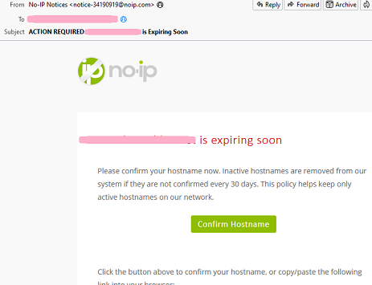

## Maintenance
[xDrip](../../README.md) >> [Features](../Features_page.md) >> [Nightscout](../Nightscout_page.md) >> [Google Cloud](./GoogleCloud.md) >> [Maintenance](./Maintenance.md)  
  
Once a month, you will receive an email informing you that your hostname is expiring.  
  
  
You need to click on "Confirm Hostname".  That will open a page giving you the option to upgrade or to renew.  
  
Just choose to extend.  There will be no need to log in.  
  
