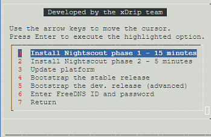
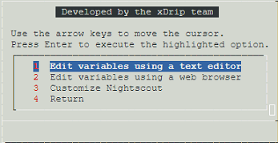
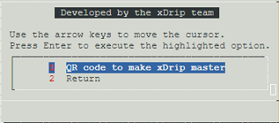
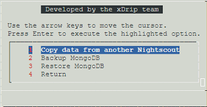

## Google Cloud Nightscout menu
[xDrip](../../README.md) >> [Features](../Features_page.md) >> [Nightscout](../Nightscout_page.md) >> [Google Cloud](./GoogleCloud.md) >> Menu  
  
When you open a [terminal](./Terminal.md), the main menu will automatically come up.  
  
  
If no menu comes up when you open a terminal, you need to [update](./NS_SyncExecutables.md) your installation files.  
  
We use SSH on Google Cloud to access the virtual machine.  It is not possible to use the mouse to click on the options on the menu.  [This](./HowToMenu.md) explains how to use menus.  
  
If you need to use the shell (terminal), select "Exit to shell".  
To return to the menu after, you can open a new terminal, or enter "menu" without the quotes in the terminal.  
   
   
  
---  
  
#### **Submenus**
There are 4 submenus.  Options 3, 4, 5 and 6 on the main menu take you to those submenus.  
  
Google Cloud setup, main menu option 3  
  
  
Nightscout setup, main menu option 4  
   
  
xDrip setup, main menu option 5  
  
  
Data, main menu option 6  
  
  
  
