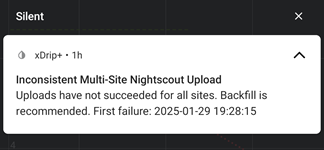

# Inconsistent multi-site Nightscout upload  
[xDrip](../../README.md) >> [Features](../Features_page.md) >> [Nightscout](../Nightscout_page.md) >> Multi-site upload failure  
  
There is an advantage in uploading to only one Nightscout site.  
  
If you choose to upload to more than one site, by entering multiple URLs separated by space, xDrip will reset the upload queue as soon as one site upload completes.  This could lead to missed Nightscout readings if all site uploads are not successful.  
When this happens, xDrip notifies you by default so that you can backfill the missing uploads.  
  
The following shows a sample notification.  
  

  
