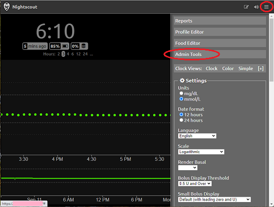

## Setting up followers  
[xDrip](../../README.md) >> [Features](../Features_page) >> [Nightscout](../Nightscout_page) >> [Nightscout on Google Cloud](./NS_GoogleCloud) >> [Setting up followers](NS_Followers)  
  
You can always use a web browser or xDrip to follow and see the readings from your Nightscout site.  
Using tokens for following is the most secure method.  Giving permission to the world to access your sirte is not.  
Also, giving the world permission to access your site may allow crawlers to access it, which will increase traffic.  In order to keep your Nighsctout project in free tier, you need to minimize traffic.  
   
   
  
---    
  
#### **Setting up Nightscout tokens for your followers**
  
Use a web browser to access your Nightscout (https://hostname) and authenticate again if needed (see [Setting up Nightscout](./NS_setup)).  
Click on the top right menu button and select "Admin Tools".  
  
  
Click on "Add new Subject".  
  
In the form that opens, enter a name.  under "Roles", copy roles from the table below it.  For example, for a follower that is only supposed to see readings and nothing else, only enter "readable" without quotes as you can see in the previous image.  You can enter a combination of different roles by separating them with ",".  
You can add an optional comment and save.  Take note of the access token.  
  
An example token that can only read is shown below.  
  
  
You can create multiple tokens with specific permissions for each to use for different followers.  
   
   
  
---  
  
#### **Setting up xDrip as a follower**  
  
In the follower xDrip, choose "Nightscout Follower" as the hardware data source.  
Under "Nightscout Follow URL", enter https://Token@hostname assuming Token is the token from the master, generated as explained above, and hostname is your noip.com hostname.  
  
If it doesn't work, try the following in a browser on the follower phone.  If it doesn't work, the token may be wrong.  
https://hostname/?token=Token, where hostname is your noip.com hostname and Token is the token from the master.  
  
