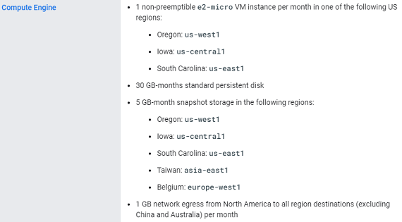

## Google Cloud cost  
[Google Cloud Nightscout](./GoogleCloud.md) >> Free Tier cost  

#### **Expected cost**  
Theoretically, if you don't reside in China or Australia, it will be free.  See Free tier limitations and requirements below.  
However, due to unwanted traffic to China caused by crawlers in China, there is a cost of $0.03 or less per month.  

The following image shows a summary of my costs (living in Canada) over 11 months.  
  

In February, I intentionally generated outgoing traffic as a test to see how much the cost will increase.  I copied the database to another Nightscout over and over again in order to create extra outgoing traffic.  
   
  
---  

#### **Why have I been charged more?**  
To satisfy the free tier requirements, you need to have only one virtual machine.  
What if you need more than one Nightscout account?  See multiple Nightscout accounts below.  
  
The only way to know exactly why you have been charged is to create a [cost table](./CostTable.md).  
   

---  
  
#### **Free Trial**
When you first sign up for Google Cloud, you can enable a free trial program, and you should.  It gives you $300 for a 3-month period.  In that period, any cost will be charged against that credit.  However, you can see in your billing what the cost is.  
Therefore, if you live in China or Australia, you can clearly see what your cost will be, using this method, without having to pay anything.  If you find out that the cost will be unreasonable, you can stop the virtual machine, before your free trial period ends, and never have to pay for it.  
  
You will need a credit card to set up billing.  
   
  
---  
  
#### **Free tier Limitations and requirements**  
When you follow the guide to install, you can see, on the status page, if you have made any mistakes that violate the Free Tier requirements.  They would be highlighted by red notes above the horizontal line on the status page.  
You can have a look at the details under the "Free Tier" heading [here](https://cloud.google.com/free/docs/free-cloud-features#free-tier).  
  
The following snapshots show the current (November 11, 2022) limitations.  
  
  
  
  
The above three regions are the regions your virtual machine can be in, not where you or your followers have to be in.  
  
  
The above constraint relates to where your followers are located.  
  
You can use the [calculator](https://cloud.google.com/products/calculator) to confirm the price.  
  
   
  
---  

#### **Traffic to China or Australia**  
If you have a follower who is in Australia or China, the data traffic from your server to them will not be free.  
The estimated cost of traffic to Australia or China is less than $0.50 per GB per month.  
    
   

---  

#### **How could crawlers cause outgoing traffic?**  
There are crawlers everywhere scanning all IP addresses looking for vulnerabilities.  
When a crawler scans your site, your Nightscout asks for either a read token or the API_SECRET.  Since the crawler does not have either, a connection will never be granted.  
But, that request for a token or the API_SECRET is an outgoing traffic.  
Any such traffic to either China or Australia is not free.  If enough crawlers scan your site, the total traffic may cross the rounding boundary to $0.01 resulting in a charge in your bill at the end of the month.  
  
   
  
---  
  
#### **Blocking traffic to China and Australia**  
We can block traffic to China in order to reduce the regular cost for those who don't live in China.  
However, this will complicate the installation scripts significantly.  
Therefore, it may be best to just put up with a cost of up to $0.03 per month.  
   

---  

#### **[Storage PD Snapshot](./SnapshotCost.md)**  
   

---  

#### **[Storage PD Capacity](./StoragePDCap.md)**  
   
  
---  

#### **Multiple Nightscout accounts**  
In order to qualify for free tier, you need to have each one of your Nightscout accounts set up in a dedicated Google account.  
There is nothing wrong with having multiple Google accounts.  
And you can use the same credit card for all of them.  
  
If you have multiple virtual machines in the same Google account and are being charged, choose one of them to move, create a backup from it, create a new Google account, create a virtual machine in it, install Google Cloud Nightsout in it, transfer your backup to it, import the backup, update your uploder to upload to the new machine, and finally delete the original machine.  
If you do that for every additional Nightscout account you have and move them to dedicated Google accounts, all of your Nightscout accounts will then qualify for free tier.  

  
