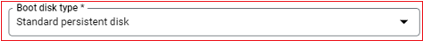
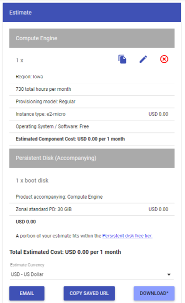
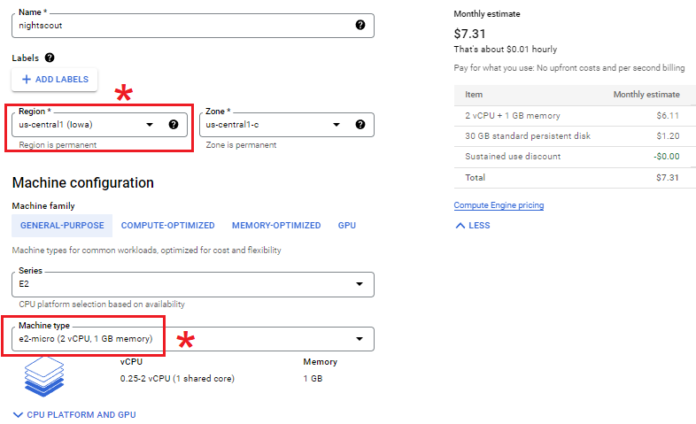

## Free Tier virtual machine  
[xDrip](../../README.md) >> [Features](../Features_page) >> [Nightscout](../Nightscout_page) >> [Nightscout on Google Cloud](./GoogleCloud) >> [Free Tier virtual machine](./NS_FreeTier)  
  
Here, We will understand the limitations and requirements of a free tier machine.   Then, we will create a free virtual machine in your Google project.  
  
### Understanding the Constraints  
You can have a look at the following, the [Google Cloud Free Program features, "Free Tier" section](https://cloud.google.com/free/docs/free-cloud-features#free-tier).  You will need to carefully select settings that qualify for the free tier category.  
The following snapshots show the current (September 4, 2022) limitations.  
  
  
The above constraint relates to where your followers are located.  
  
  
The above three regions are the regions your virtual machine can be in, not where you or your followers have to be in.  
  
  
  
  
  
  
  
You can use the [calculator](https://cloud.google.com/products/calculator) to confirm the price.  
  
  
### Creating a virtual machine  
Let's create the machine now.    
Go to dashboard.  Select "Compute Engine".  Select the "VM instances" tab in the left pane if it's not already selected.  
Select "Create Instance".  
  
  
Set name to "nightscout".    
  
Set machine type to "e2-micro".  
Select a region that qualifies for free tier.  
  
  
  
Edit "Boot Disk" and modify as shown below.  Click on "Select".  
  
  
Under firewall, enable both http and https.  
  
  
Click on "Create" to create the virtual machine.  Google will now bring up your virtual machine.  Wait for it to come up.  When the external IP column appears, you should be good to go.  
  
[Delete a VM](./images/DeleteVM.png)  
  
