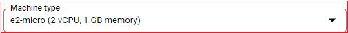

## Free Tier  
[xDrip](../../README.md) >> [Features](../Features_page) >> [Nightscout](../Nightscout_page) >> [Nightscout on Google Cloud](./GoogleCloud) >> Free Tier  
  
Here, We will understand the limitations and requirements of a free tier machine.  
  
You can have a look at the following, the [Google Cloud Free Program features, "Free Tier" section](https://cloud.google.com/free/docs/free-cloud-features#free-tier).  You will need to carefully select settings that qualify for the free tier category.  
The following snapshots show the current (September 4, 2022) limitations.  
  
  
The above constraint relates to where your followers are located.  
  
  
The above three regions are the regions your virtual machine can be in, not where you or your followers have to be in.  
  
  
  
  
  
  
  
You can use the [calculator](https://cloud.google.com/products/calculator) to confirm the price.  
  
 
