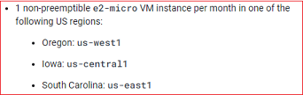
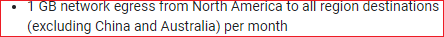

## Free Tier  
[xDrip](../../README.md) >> [Features](../Features_page) >> [Nightscout](../Nightscout_page) >> [Nightscout on Google Cloud](./GoogleCloud) >> Free Tier  
  
Here, We will understand the limitations and requirements of a free tier machine.  
  
You can have a look at the details under the "Free Tier" heading [here](https://cloud.google.com/free/docs/free-cloud-features#free-tier).  
When you create your virtual machine, you will need to carefully select settings that qualify for the free tier category.  
  
The following snapshots show the current (November 11, 2022) limitations.  
  
  
  
  
The above three regions are the regions your virtual machine can be in, not where you or your followers have to be in.  
  
  
The above constraint relates to where your followers are located.  
  
You can use the [calculator](https://cloud.google.com/products/calculator) to confirm the price.  
  
 
