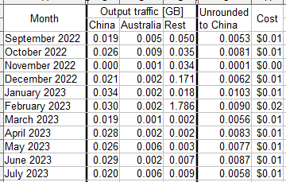

## Google Cloud cost  
[Google Cloud Nightscout](./GoogleCloud.md) >> Free Tier cost  

#### **Expected cost**  
Theoretically, if you’re not residing in China or Australia, using Google Clouds Nightscout should be free. However, due to unwanted traffic from crawlers in China, there may be a nominal cost of $0.03 or less per month.  
  
In the following image, you can see a summary of my costs (living in Canada) over an 11-month period.  
   
   
  
---  

#### **Why have I been charged more?**  
To stay within the free tier, you need to have only one virtual machine. If you require more than one Nightscout account, see the section titled "Multiple Nightscout accounts" below.    
  
To determine the exact reason for any charges, you should create a [cost table](./CostTable.md).  
   

---  
  
#### **Free Trial**
When you first sign up for Google Cloud, you can enable the free trial program, which gives you $300 in credits for a 3-month period. During this time, any costs will be covered by this credit. You can monitor your costs through the billing dashboard.  
  
For residents in China or Australia, this trial period allows you to see potential costs without paying upfront. If the costs are higher than expected, you can stop the virtual machine before the trial ends to avoid any real charges.  
  
You will need a credit card to set up billing.   
   
  
---  
  
#### **Free tier Constraints**  
Follow the installation guide to ensure you meet the free tier requirements. On the status page, any violations of these requirements will be highlighted in red above the horizontal line.  
  
Check the ["Free Tier" section](https://cloud.google.com/free/docs/free-cloud-features#free-tier) for detailed limitations.  
  
You can have a free virtual machine only in specified regions, but this doesn’t restrict the location of your followers.  
   
  
---  
  
#### **Traffic to China and Australia**  
Traffic to China or Australia is not covered under the free tier. Estimated costs for such traffic are less than $0.50 per GB per month.  
   

---  

#### **How Crawlers Cause Outgoing Traffic?**  
Crawlers scan IP addresses and can generate outgoing traffic even if they don’t access your site properly. Requests from these crawlers, such as for a read token or API_SECRET, may result in charges if the traffic exceeds the free tier threshold.  
   
  
---  
  
#### **Blocking traffic to China and Australia**  
While blocking traffic to these regions could reduce costs, it may complicate installation scripts. If the cost is minimal, up to $0.03 per month, it might be easier to accept this small expense.   
   
  
---  

#### **[Storage PD Snapshot](./SnapshotCost.md)**  
   

---  

#### **[Storage PD Capacity](./StoragePDCap.md)**  
   
  
---  

#### **[Multiple Nightscout accounts](./MultipleAccounts.md)**  
  
