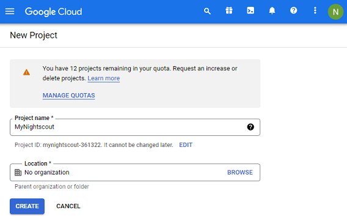
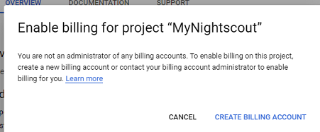

## Google Cloud project  
[xDrip](../../README.md) >> [Features](../Features_page) >> [Nightscout](../Nightscout_page) >> [Nightscout on Google Cloud](./GoogleCloud) >> [Google Cloud project](./NS_GCProject)  
  

You will need a Google account, a Google project, and activated billing for the Google project.  We will take care of all that now.  
  
Create a Google account if you don't have one already.  
  
Go to  [https://console.cloud.google.com](https://console.cloud.google.com) and log in with your Google account.  
  
  
Create a project.  
  
  
Select your new project.  
  
  
Go to dashboard.  
  
  
Select "Compute Engine".  
  
  
Enable.  
  

Enable billing.  
  
  
Go to https://console.cloud.google.com/
Enable the engine again.  It will ask you to enable billing again.  But, this time, select the billing account you just created.  
Enable billing for your new project.  
  
  
You will be asked to select your country and describe your organization.  Select "Personal project".  
  
  
Enter billing details.  Select "Start free trial".  
  
