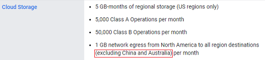

## Nightscout on Google Cloud  
[xDrip](../../README.md) >> [xDrip & Nightscout](../Nightscout_page) >> [Nightscout on Google Cloud](./NS_GoogleCloud)  
  
#### **Credit:**    
Thanks to jamorham, the current xDrip head developer, for the idea, putting it together, implementing the installer, and testing everything.  
   
  
We used to set up Nightscout on Heroku for free.  Heroku have decided to end their free offering on November 28, 2022.    
We are currently testing this.  We need to confirm that it will be free.  We will know soon.  
  
If you are confident with tech and have time and are interested, you can try this.  Please provide feedback.  
  
If you already have a working Nightscout on Heroku, there is no rush to switch to this now.  One of the subjects that will be added to this guide, after being tested, will explain how to transfer a database from Heroku (Atlas) to this Google Cloud database.  
  
If you want a tested and proven method to switch to once, and be done with it, please be patient and don't try this yet.  We still have lots of time and there is no rush.  
  
You will need a credit card to set up billing.  The hope is that this will be free.  Regardless, a credit card is required.  
If you have a follower who is in Australia or China, the data traffic from your server to them will not qualify for Free Tier.  This is based on the following note:  
  
I hope to add more detail here quantifying what the cost will be in a case like that.  
  
The screenshots have been created from a computer.  It may be difficult to follow on a mobile device.  
It will take a while (about 90 minutes) to go through the entire setup.  
   
  
[No IP registration](./noip_com)  
[Google Cloud project](./NS_GCProject)  
[Free Tier virtual machine](./NS_FreeTier)  
[Linux/Nightscout install](#linuxnightscout-install)  
[Finalize Linux install](#finalize-linux-install)  
[Setting up Nightscout](#setting-up-nightscout)  
[Setting up xDrip to upload to your Nightscout](#setting-up-xdrip-to-upload-to-your-nightscout)  
[Setting up Nightscout tokens for your followers](#setting-up-nightscout-tokens-for-your-followers)  
[Setting up xDrip as a follower](#setting-up-xdrip-as-a-follower)  
[Editing Nightscout variables](#editing-nightscout-variables)    
