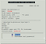
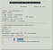
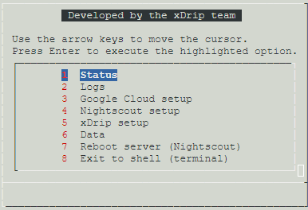

## Linux/Nightscout install  
[xDrip](../../README.md) >> [Features](../Features_page) >> [Nightscout](../Nightscout_page) >> [Nightscout on Google Cloud](./GoogleCloud) >> Linux/Nightscout install  
  
Now, we will update Linux on our [virtual machine](./NS_FreeTier), and install Nightscout on it.  You must have [No IP](./noip_com.md) and [Google Project](./NS_GCProject.md) set up already to proceed.  
  
Open a [terminal](./Terminal.md).  

Copy and paste the following highlighted line into the terminal of your Nighscout virtual machine and enter.  
**Caution:** Be very careful not to copy it into any other computer as it could overwrite the contents of the machine.  
  
<mark style="background-color: #dFbFff">curl https://raw.githubusercontent.com/jamorham/nightscout-vps/vps-1/bootstrap.sh | bash</mark>  
   
  
You will be presented with a notification.  To acknowledge, you need to select OK.  However, you will not be able to use the mouse.  Just press enter.  
It will take 2 minutes to complete a preliminary installation step.  You will then see the status page.  If any item on the page is in red, it mean you made an incorrect selection when you created the virtual machine.  The following table shows what the status page should look like, as well as what it will look like for different incorrerct selections.  

| Incorrect choice | Status page |  
| ---------------- | ----------- |  
| Machine type |  |  
| Disk type |  |  
| Disk size |  |  
| Firewall |  |  
| Ubuntu |  |  

The machine will reboot then.  You will see a disconnect message on the screen.  Wait 30 seconds and click on retry.  This time when the terminal opens, you will see this menu:  
  
  
<video width="400" controlsList="nodownload" src="./video/Install1.mp4" controls>  
</video>  
   
   

To continue the installation, select item 1 (using arrows) "Initial Nightscout install" and enter.  
It will take about 15 minutes for this step to complete.  
If you get an error message that says EINTEGRITY ending with (0 bytes) and it hangs (screen showing the same content for more than 10 minutes), just press CTRL and C keys at the same time to interrupt.  Exit and open a new terminal.  Repeat running item 1 on the menu.  
  
<video width="400" controlsList="nodownload" src="./video/Install2.mp4" controls>  
</video>  
<video width="400" controlsList="nodownload" src="./video/Install3.mp4" controls>  
</video>  
   
   
  
After step 1 is completed, to proceed with installation, choose item 2 on the menu "noip.com association" and enter.  
You will be asked to login.  
  
To log in, use the email address and password you used to register for noip.com.  
  
Leave the update interval at 30.  
select N for running command during update.  
Enter email address "used for urgent renewal ...".  
Press A to accept the terms of service.  
Press N to decline sharing email address.  
Select 2 to redirect to secure https.  
  
You will be asked to change the API secret.  This is the password you will login to Nightscout with.  
Enter a password and take note.    
  
When installation is complete, the machine will automatically reboot again and you will see the disconnect message again.  
Wait 30 seconds, and Nightscout will be running.  
 
