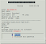
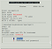
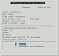

## Linux/Nightscout install  
[xDrip](../../README.md) >> [Features](../Features_page) >> [Nightscout](../Nightscout_page) >> [Nightscout on Google Cloud](./GoogleCloud) >> Linux/Nightscout install  
  
Now, we will update Linux on our [virtual machine](./NS_FreeTier), and install Nightscout on it.  You must have [FreeDNS](./FreeDNS.md) and [Google Project](./NS_GCProject.md) set up already to proceed.  
  
Open a [terminal](./Terminal.md).  

Copy and paste the following highlighted line into the terminal of your Nighscout virtual machine and enter.  
**Caution:** Be very careful not to copy it into any other computer as it could overwrite the contents of the machine.  
  
<mark style="background-color: #eFdFef">curl https://raw.githubusercontent.com/jamorham/nightscout-vps/vps-1/bootstrap.sh | bash</mark>  
   
  
You will be presented with a notification.  To acknowledge, you need to select OK.  However, you will not be able to use the mouse.  Just press enter.  
It will take a few minutes to complete a preliminary installation step.  You will then see a note or the status page.  If the note directs you to delete the machine and create a new one or if any item on the status page is in red, it means you made an incorrect selection when you created the virtual machine.  The following table shows what you will see depending on each possible incorrect choice.  
  
| Incorrect choice | Outcome |  
| ---------------- | ----------- |  
| Region |  |  
| Machine type |  |  
| Disk type |  |  
| Disk size |  |  
| Firewall |  |  
| Ubuntu |  |  
  
If nothing is red on the status page, just press enter to close the status page.  You will see this menu:  
  
  
<video width="400" controlsList="nodownload" src="./video/Install1.mp4" controls>  
</video>  
   
   

To continue the installation, select item 2 (using arrows) "Installation Phase 1" and enter.  
It will take about 15 minutes for this step to complete.  
If SSH disconnects and you see a disconnect message, please reconnect and run item 2 again.  
You will see error messages.  Please be patient allowing the process to complete.  
  
<video width="400" controlsList="nodownload" src="./video/Install2.mp4" controls>  
</video>  
<video width="400" controlsList="nodownload" src="./video/Install3.mp4" controls>  
</video>  
   
   
  
After phase 1 is completed, to proceed with installation, choose item 3 on the menu "Installation Phase 2" and enter.    
  
You will be asked to choose API-SECRET.  Enter a password and take a note.  You will need it to access Nightscout.  
<video width="400" controlsList="nodownload" src="./video/Install4.mp4" controls>  
</video>  
   
   

Leave the update interval at 30.  
For the next question, you don't need to press enter.  Press N for running command at successful update (no need to press enter).  
Enter email address "used for urgent renewal ...".  
Press A to accept the terms of service.  
Press N to decline sharing email address.  
  
You will be asked to change the API secret.  This is the password you will login to Nightscout with.  
Enter a password and take note.    
  
When installation is complete, the machine will automatically reboot again and you will see the disconnect message again.  
Wait 30 seconds, and Nightscout will be running.  
 
