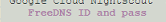

## Linux/Nightscout install  
[Google Cloud Nightscout](./GoogleCloud.md) >> Linux/Nightscout install  
  
Now, we will update Linux on our [virtual machine](./NS_FreeTier.md), and install Nightscout on it.  You must have [FreeDNS](./FreeDNS.md) and [Google Project](./NS_GCProject.md) set up already to proceed.  There are also video clips (silent) on this page that may be helpful if the instructions are not clear.  
   
  
---  
  
**Bootstrap**    
Open a [terminal](./Terminal.md).  
  
Copy and paste the following highlighted line into the terminal of your Nighscout virtual machine and enter.  
**Caution:** Be very careful not to copy it into any other computer as it could overwrite the contents of the machine.  
  
<input type="text" value="curl https://raw.githubusercontent.com/jamorham/nightscout-vps/vps-1/bootstrap.sh | bash" readonly id="myInputText" style="border:none; color:#101010; background-color:#ededed; width:100%; font-size:15px">  
<button onclick="FunctionCopyText()" style="border: 1px solid #0066ff; color:#f0f0f0; background: linear-gradient(#0066ff, #0066ff); font-size:14px; background-color:#0066ff; font-weight:400; border-radius: 2px; margin-left:70px; margin-top:8px; padding:4px 12px; display:inline-block; box-shadow: inset 0px 1px 0px rgba(255,255,255,.3), 0px 1px 5px rgba(0,0,0,.7); :hover ">Copy</button>  
  
   
  
You will be presented with a notification.  To acknowledge, you need to select OK.  However, you will not be able to use the mouse.  Just press enter.  [This](./HowToMenu.md) explains how the menus work.  
It will take a few minutes to complete a preliminary installation step.  You will then see a note or the status page.  
The following table shows what you may see depending on different choices you can make.  
  
| Incorrect choice | Clue | Outcome |  
| :--------------: | :----------: | :-----: |  
| Nothing |  | All good ✅ |  
| Region |  | Not free ❌ |  
| Machine type |  | Not free ❌ |  
| Disk type |  | Not free ❌ |  
| Disk size |  | Unused resource   Not free ❌ |  
| Firewall |  | Insecurity ❌ |  
| Ubuntu |  | Incompatibility ❌ |  
  
If the note directs you to delete the machine and create a new one or if any item above the horizontal line on the status page is in red, it means you made an incorrect selection when you created the virtual machine.  If this is a new virtual machine and you have no database on it yet, [delete the virtual machine](./DeleteVM.md) and go back and repeat the [virtual machine](./VirtualMachine.md) step.  
  
If you did not get a notification to recreate the machine, because of a wrong Ubuntu version, and nothing is red above the horizontal line on the status page, just press enter to close the status page.  All the red notes you see below the horizontal line are expected at this stage and you can ignore them.  You will see this menu:  
  
  
<video width="400" controlsList="nodownload" src="./video/Install1.mp4" controls>  
</video>  
   
  
If you need a break, this is a good time.    
   
   
  
---  
  
**Phase 1**  
To continue the installation, go to the Google Cloud setup submenu and select item 1 "Install Nightscout Phase 1" and enter.  
It will take about 15 minutes for this step to complete.  
If SSH disconnects and you see a disconnect message, please reconnect and run Install Nightscout Phase 1 again.  
You will see a few error messages.  Those are expected and can be ignored.  Please be patient allowing the process to complete.  
  
<video width="400" controlsList="nodownload" src="./video/Install2.mp4" controls>  
</video>  
   
  
If you need a break, this is a good time.    
   
   
  
---
  
**Phase 2**  
You will be asked to provide an email address in this stage.  Please see [this page](./GC_WhyEmail.md) if you are wondering why.  
To complete the installation, go to the Google Cloud setup submenu and select item 2 on the menu "Install Nightscout Phase 2" and enter.    
  
You will be asked to choose API_SECRET.  You will need your API_SECRET to access Nightscout.  
[This](./HowToMenu.md) explains how to use the menus without a mouse.  
Enter a password, excluding the following characters, and take note.  Or, choose cancel to keep it as is.  
  
$ &nbsp; &nbsp; \" &nbsp; &nbsp; \' &nbsp; &nbsp; \\ &nbsp; &nbsp; SPACE &nbsp; &nbsp; @ &nbsp; &nbsp; /
  
   
  
You will be asked to enter your FreeDNS user ID and password.  
  
Enter those.  
You cannot use your email address for user ID.  If you don't remember your FreeDNS user ID, you can log into [FreeDNS](https://freedns.afraid.org/menu/), where your user ID will be shown in the right pane at the top.  Or, you can look at the verification email you received when you first signed up for FreeDNS.  It shows your user ID as well.  
  
After you enter your user ID and password, you can press enter to submit.  
If you have more than one subdomain, you will be asked to identify the one you want to use.  In that case, you need to enter the first few characters of the subdomain to identify it with respect to your other subdomains, and press enter.  
  
You may be directed to exit and try again (internal error).  Do that.  If you are presented with a note that there is an [existing certificate](./ExistingCertificate.md), choose 2.  **If you are asked again to retry, please close the window.**  Open a new window.  Use "Reboot server" from the menu to reboot the server.  Wait 30 seconds.  Click on retry to reconnect.  Run install Nightscout phase 2 again.  

You may see an error of "[Too many requests of a given type](./TooManyCertificates.md)".  
  
After successful setup, you will be asked to enter an email address for security notices.   
Enter an email address.  
You will be asked to confirm a restart.  Please do.  You will see the disconnect message.  
Wait 30 seconds, and Nightscout will be running.  
 
<video width="400" controlsList="nodownload" src="./video/Install4.mp4" controls>  
</video>  
  
   
  
