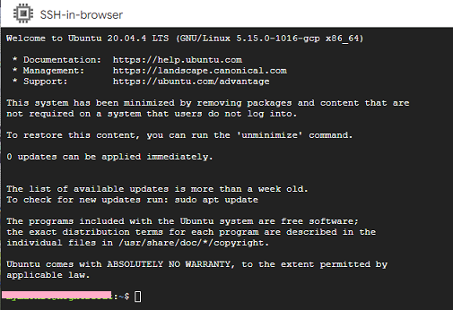

## Linux/Nightscout install  
[xDrip](../../README.md) >> [xDrip & Nightscout](../Nightscout_page) >> [Nightscout on Google Cloud](./GoogleCloud) >> [Linux/Nightscout install](./NS_Install)  
  
After the external IP address column is populated, click on "SSH" on the right side of the IP address.  A terminal will appear shortly.  
  

Copy and paste the following line into the terminal.  Be very careful not to copy it into any other machine as it will overwrite the contents of the machine.  
curl https://raw.githubusercontent.com/jamorham/nightscout-vps/vps-1/bootstrap.sh \| bash  
   
Enter.  
  
