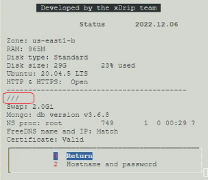
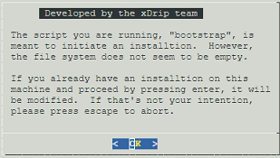
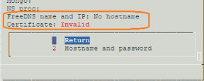

## Update Google Cloud Platform
[Google Cloud Nightscout](./GoogleCloud.md) >> Update to latest release  
  
We update the Google Cloud Nightscout platform in order to add functionality and fix issues.  This is how you can update your platform to access 
 those improvements.  
If you have not completed the [installation](./GoogleCloud.md), please complete it first.  
  
Open a [terminal](./Terminal.md).  A [menu](./Menu.md) should come up automatically.  Select `Update platform` from the Google Cloud setup submenu.  You can then check the status page to confirm that your setup has been updated by comparing it to [this](./Status.md).  
  
If you created your setup prior to January 2023 and never updated it, you may need to go through a few other steps first, explained in a corresponding section below, to complete the update.  
   
   
  
---  

#### **502 Bad Gateway**  
If after you update your platform, Nightscout is not running and you get a "502 bad gateway" error when you attempt to access your Nightscout in a browser, even after a [restart](./Restart.md), proceed with the following.  
From the Google Cloud setup submenu, select "Install Nightscout phase 1" and enter.  Wait for it to complete.  
Then, [restart](./Restart.md) Nightscout.  
   

---  
  
#### **If you created your setup before January 2023 and never updated**  
Our platform has evolved significantly since it was first released.  You don't need to start from scratch.  But, you may need to go through a few more steps in order to update.  After you update, there will be no difference between your setup and one that has just been created.  

If you are still using noip.com, you will be asked, below, to create a FreeDNS account and a new hostname in order to switch from noip.com to FreeDNS.  
  
If a menu does not open when you open a terminal, please skip to the section titled "Bootstrap" below.  
  
If a menu opens when you open a terminal, from the menu, or Google Cloud setup submenu, select "Update scripts" or "Update platform".  After completion and closing the terminal and opening a new one, if a menu does not automatically open up, please skip to the section titled "Bootstrap" below.  
  
View the Status page by selecting `Status`.  If it looks like [this](./images/Status.png), the platform has updated to the latest.  If not, please update platform from the Google Cloud setup submenu again.  
  
If the status page still looks different, for example, if the username, repository name and branch name are blank, as shown below, please proceed to the section titled "Bootstrap" below.  
  
   
  
---  
  
#### **Bootstrap**  
Open a [terminal](./Terminal.md).  If a menu opens, select `Bootstrap` from the Google Cloud submenu.  
  
If no menu opens after opening a terminal, copy the highlighted text below and paste into the terminal.  Press enter.  
  
<input type="text" value="curl https://raw.githubusercontent.com/jamorham/nightscout-vps/vps-1/bootstrap.sh | bash" readonly id="myInputText" style="border:none; color:#101010; background-color:#ededed; width:100%; font-size:15px">  
<button onclick="FunctionCopyText()" style="border: 1px solid #0066ff; color:#f0f0f0; background: linear-gradient(#0066ff, #0066ff); font-size:14px; background-color:#0066ff; font-weight:400; border-radius: 2px; margin-left:70px; margin-top:8px; padding:4px 12px; display:inline-block; box-shadow: inset 0px 1px 0px rgba(255,255,255,.3), 0px 1px 5px rgba(0,0,0,.7); :hover ">Copy</button>  
  
   
  
You will see the following note:  
  
Press enter to proceed.  After bootstrap is complete, you will go to the status page.  
You must now run `Install Nightscout phase 1` from the Google Cloud setup submenu.  
Please proceed to the following sections.  
   
  
---    
  
#### **No Hostname**
If you are still using noip.com, after you run bootstrap and run `Install Nightscout phase 1`, you will see "No hostname" on the status page as shown below.  
  
  
To switch to FreeDNS, please follow the instructions [here](./FreeDNS.md) to create a FreeDNS account and create a new hostname.  
Then, please run "Install Nightscout phase 2" from the Google Cloud setup submenu.  
     
  
