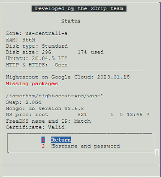

## Update Google Cloud Nightscout platform
[xDrip](../../README.md) >> [Features](../Features_page.md) >> [Nightscout](../Nightscout_page.md) >> [Google Cloud](./GoogleCloud.md) >> Update to latest release   
  
This is how you can update the menus, commands and packages on your virtual machine.  This is not about updating Nightscout.  If you want to update Nightscout, please have a look at [this](./update_nightscout.md).  
  
Open a [terminal](./Terminal.md).  A [menu](./Menu.md) should come up automatically.  Select "Update platform" from the Google Cloud setup submenu.  You can then check the status page to confirm that your setup has been [updated](./GC_ReleaseNotes.md).  
<br/>  
  
---  
  
#### **If you created your setup a long time ago**  
Our platform has evolved significantly since it was first released.  You don't need to start from scratch.  But, you may need to go through a few steps in order to update depending on how long ago you created your setup.  After you update, there will be no difference between your setup and one that has just been created.  

Are you still using noip.com?  If yes, you will be asked, below, to create a FreeDNS account and a new hostname to use instead to switch from noip.com to FreeDNS.  
  
If a menu does not open when you open a terminal, you have a very old version of our platform.  To update, please skip to the section titled "Bootstrap" below.  
  
If a menu opens when you open a terminal, from the menu, or Google Cloud setup submenu, select "Update scripts" or "Update platform".  After completion and closing the terminal and opening a new one, if a menu does not automatically open up, please skip to the section titled "Bootstrap" below.  
  
View the Status page by selecting "Status".  If it looks like [this](./images/Status.png), the platform has updated to the latest.  If not, please update platform from the Google Cloud setup submenu again.  
  
If the status page still looks different, for example, if the username, repository name and branch name are blank, as shown below, please proceed to the section titled "Bootstrap" below.  
  
<br/>  
  
---  
  
#### **Bootstrap**  
Open a [terminal](./Terminal.md).  If a menu opens, select "Bootstrap" from the Google Cloud submenu.  
  
If no menu opens after opening a terminal, copy the entire highlighted text below and paste into the terminal.  Press enter.  
  
```  
curl https://raw.githubusercontent.com/jamorham/nightscout-vps/vps-1/bootstrap.sh | bash
```  
<br/>  
  
You will see the following note:  
  
Press enter to proceed.  After bootstrap is complete, you will go to the status page.  
  
**You must now run "Install Nightscout phase 1" from the Google Cloud setup submenu.**  
<br/>  
  
Please proceed to the following sections.  
<br/>  
  
---  
  
#### **Missing packages**
If you see "Missing packages" on the status page as shown below, please run "Update platform" from the Google Cloud setup submenu again.  
  
<br/>  
  
---  
  
#### **No Hostname**    
If you are still using noip.com, after you run bootstrap and run "Install Nightscout phase 1", you will see "No hostname" on the status page as shown below.  
  
  
To switch to FreeDNS, please follow the instructions [here](./FreeDNS.md) to create a FreeDNS account and create a new hostname.  
Then, please run "Install Nightscout phase 2" from the Google Cloud setup submenu.  
  
