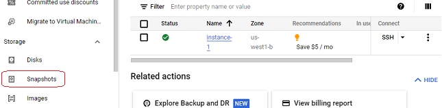
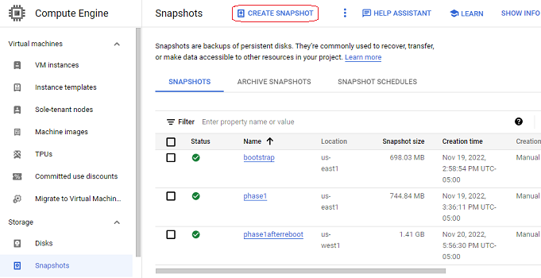
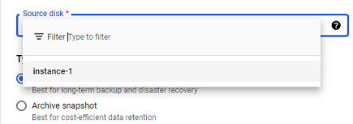
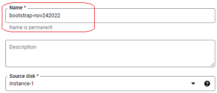
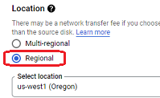

## Google Cloud snapshots
[xDrip](../../README.md) >> [Features](../Features_page) >> [Nightscout](../Nightscout_page) >> [Google Cloud](./GoogleCloud) >> Snapshots  
  
You can create a snapshot of the virtual machine disk.  Then, if you experiement and run into trouble, you can always restore the snapshot to reurn the disk to the way it was ehen you created the snapshot.
Of course this means any data added to the database since the snapshot was created will be lost also.  So, you should use this utility taking into account that consequence.  
  
Let's go through the steps.  Let's say we have run bootstrap, the first step in installation.  And let's create a snapshot.   
  
When on the Compuete Engine page, click on Snapshots in the left pane.  
  
  
Click on create snapshot at the top.  
  
  
Select the disk in your virtual machine from the pull-down menu under "Source disk".  
  
  
If you have just completed an install phase, you may see nothng under the pull-down menu.  Just return to the dahsboard and go through the menu items to get back to the snapshot creation page.  
  
Give a name (all lower case) to the snapshot so that you can easily identify it later.  
  
  
Make sure to select Regional under Location.  By default, Multi-regional is selected.  Otherwise, there may be a cost.  
  
  
