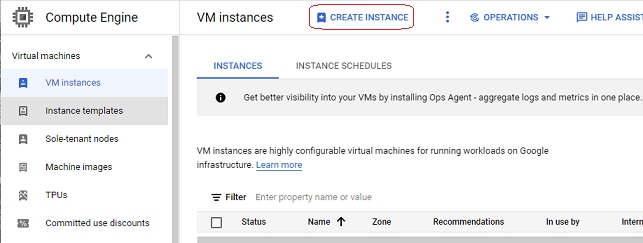
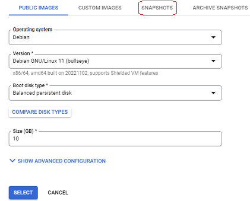
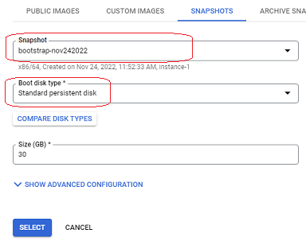

## Google Cloud snapshots
[xDrip](../../README.md) >> [Features](../Features_page) >> [Nightscout](../Nightscout_page) >> [Google Cloud](./GoogleCloud) >> Snapshots  
  
You can create a snapshot of the virtual machine disk.  Then, if you experiment and run into trouble, you can always restore the snapshot to return the disk to the way it was when you created the snapshot.
Of course this means any data added to the database since the snapshot was created will be lost also.  So, you should use this utility taking into account that consequence.  
   
  
---  
**Create**  
Let's go through the steps.  Let's say we have run bootstrap, the first step in installation.  And let's create a snapshot.   
  
When on the Compute Engine page, click on Snapshots in the left pane.  
  
  
Click on create snapshot at the top.  
  
  
Select the disk in your virtual machine from the pull-down menu under "Source disk".  
  
  
If you have just completed an install phase, you may see nothing under the pull-down menu.  Just return to the dashboard and go through the menu items to get back to the snapshot creation page.  
  
Give a name (all lower case) to the snapshot so that you can easily identify it later.  
  
  
Make sure to select Regional under Location.  By default, Multi-regional is selected.  Otherwise, there may be a cost.  
  
  
Click on "Create" at the bottom of the page.  
Depending on how much data you have on the disk, this could take a different amount of time to complete.  For a fresh install with no database imported yet, it take about a minute.  
  
Pay attention to the total size of your snapshots.  If you go over a limit (5GB), it will not be free.  
  
  
The following screenshot shows the free tier limits.  
  
   
  
---  
  
**Restore**
Let's now go through the steps of restoring a snapshot.  
  
**WARNING**
You can have only one machine in order to satisfy the free tier limits.  Therefore, in order to restore a snapshot, you will need to first delete your existing machine.  Doing that (deleting your machine) will delete your Nightscout database.  
Please don't proceed if you are not sure what you are doing.  
This may be a useful tool to have while you are experimenting with your choices at the beginning and have not copied your database yet.  
  
Only if you have no data on the machine, or only after you have backed up your database and have copied the backup file from the virtual machine to your real computer, delete the machine on the VM instances tab.  
  
Click on create instance.  
  
  
Choose region.  It's not enough to choose a free region.  It must be the same region the machine in the snapshot was in.  Looking at the snapshot, you can see what region the machine was in under the Location heading.  
  
Choose e2-micro for the machine type.  
  
Under boot disk, click on change.  
At the top, click on "Snapshots".  
  
  
Select the snapshot.  
Make sure to change disk type to standard.  By default, it is set to balanced.  Click on select.  
  
  
Under firewall options, enable allow http traffic and allow https traffic.  
  
Click on create at the bottom.  Wait for the machine to be created.  
After the machine is created, click on SSH to open the terminal and see the menu.  
Use Status to ensure the free tier settings are satisfied.  
  
