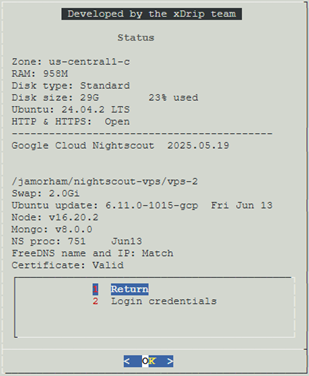

## Status page
[xDrip](../../README.md) >> [Features](../Features_page) >> [Nightscout](../Nightscout_page) >> [Nightscout on Google Cloud](./GoogleCloud) >> Status page  
  
Choose Status from the menu.  You will see a page showing details about your machine and what's on it.  
  
The content can be useful when troubleshooting your Nightscout.  
  
