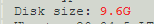
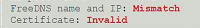
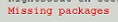
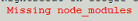
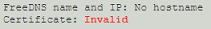
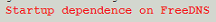

## Status page keywords
[Google Cloud Nightscout](./GoogleCloud.md) >> Google cloud Nightscout status page keywords  
  
The [status page](./Status.md) shows very important information that can help figure out what could be wrong when there is a malfunction.  
If you ask for help, please include a screenshot of the status page.  
  
The following table lists the different keywords that may be shown on the status page with their description.  
  
| &nbsp; &nbsp; &nbsp; Marker &nbsp; &nbsp; &nbsp; | Meaning  | Solution | Notes |  
| ------ | ------- | -------- | ------ |  
|  | Disk size less than 30GB | [Resize disk](./FullDisk.md) | |  
|  | Dormant FreeDNS | [Extend account](./FreeDNS_Min_Login.md) | 1 |  
|  | New packages available | [Update platform](./NS_SyncExecutables.md) | 1 |  
|  | Must complete bootstrap | Install Nightscout phase 1 from the Google Cloud setup submenu. | |  
|  | Are you still using noip.com? | Follow [this](./FreeDNS.md) and then Install Nightscout Phase 2 from the Google Cloud setup submenu. | 1 |  
|  | You cannot restart the server if the FreeDNS site is down. | Install Nightscout Phase 2 from the Google Cloud setup submenu. | 1, 2 |  
  
1 - During the installation phase, you can ignore these markers.  But, they must be fixed if you see them after.  
2 - You don't have to choose a different API_SECRET.  If you are happy with your existing API_SECRET, choose cancel when you are asked to change it.   
  
