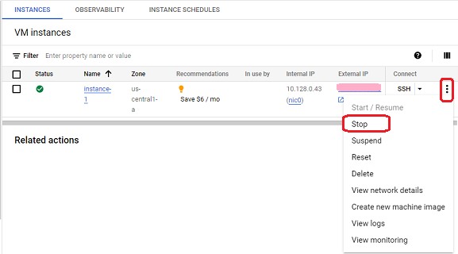

## Stopping or starting the virtual machine  
[Google Cloud Nightscout](./GoogleCloud.md) >> Stop and start virtual machine  
  
You may need to stop a virtual machine if you cannot meet the free tier requirements, which allow only one virtual machine to be running at a time.  Or, your instance may stop because of an intrruption in [payments](./NS_FreeTier.md).  
Keep in mind that a virtual machine running Nightscout is stopped, its IP address will change when you start it again.  
  
To stop a virtual machine, go to the [compute engine](./ComputeEngine.md).  

Choose `Stop` from the 3-dot menu.  
  

If the virtual machine is stopped, you can start it from the same menu.  
   
  
---  
  
#### **IP Address**  
After starting a virtual machine that had been stopped, its IP address will differ from the one it had before.  
  
After restarting the virtual machine, please be patient for up to 2 minutes for the new IP address to be mapped to your hostname. During this time, you will not be able to access Nightscout in a browser or connect with your followers right away.   
  
