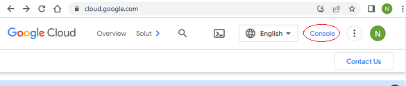

## Virtual machine terminal
[xDrip](../../README.md) >> [Features](../Features_page) >> [Nightscout](../Nightscout_page) >> [Google Cloud](./GoogleCloud) >> [Terminal](./Terminal)  
  
You may need to access a Linux terminal on your virtual machine.  This is how you can do that.  
You can do this only after having [installed Linux](./NS_Install).  
  
Go to [Google Cloud](https://cloud.google.com/).  
Sign in using your Google account.  
Click on Console.  
  
  
Go to dashboard.  
    
  
Select "Compute Engine".  
    
  
