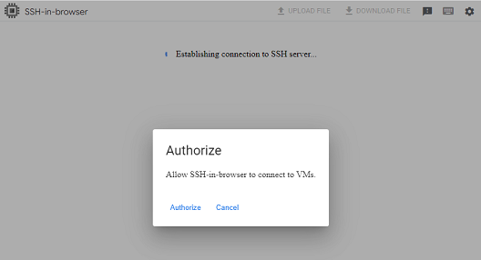
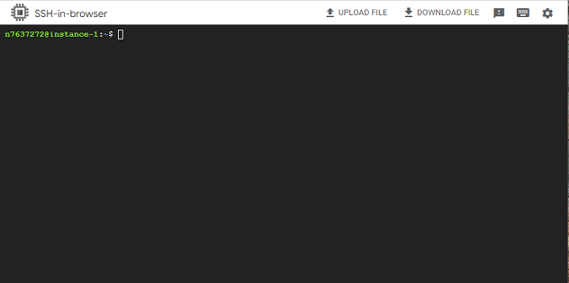

## Virtual machine terminal
[Google Cloud Nightscout](./GoogleCloud.md) >> Terminal  
  
You can access a Linux terminal on your virtual machine if you have completed the setup of your [virtual machine](./VirtualMachine.md).  
  
If you have logged out, go to [Google Cloud](https://cloud.google.com/) and sign in using your Google account.  
Click on Console.  
  
  
Go to dashboard.  
    
  
Select "Compute Engine".  
    
  
Click on SSH on the line associated with your Nightscout virtual machine.  
  
If your browser asks permission to open a window, grant it.  If your browser is set to block pop-ups, this will not work.  You will need to change your browser's settings to allow pop-ups from the Google Cloud page.  

If you see the following, please authorize.  
  
  
Be patient as it may take a few seconds for the terminal to come up.  
  
  
If you have completed installation already, a menu will come up in the terminal.  
  
If you need to use the terminal (shell), you can close the menu (exit to shell).  
  
If instead, you get a connectivity error message shown in the following image, click on "Retry without Cloud Identity-Aware Proxy".  
  
  
When you are done using the terminal, you can click on X at the top right corner to close it.  
  
