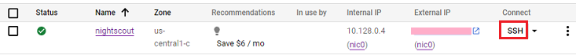

## Virtual machine terminal
[xDrip](../../README.md) >> [Features](../Features_page) >> [Nightscout](../Nightscout_page) >> [Google Cloud](./GoogleCloud) >> Terminal  
  
You can access a Linux terminal on your virtual machine if you have [installed Linux](./NS_Install).  
  
If you have logged out, go to [Google Cloud](https://cloud.google.com/) and sign in using your Google account.  
Click on Console.  
  
  
Go to dashboard.  
    
  
Select "Compute Engine".  
    
  
Click on SSH on the line associated with your Nightscout virtual machine.  
  
  
Be patient as it may take a few seconds for the terminal to come up.  
    
When you are done, you can type exit to close the terminal or just click on X at the top right corner.  
  
