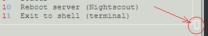

## To Do List
[xDrip](../../README.md) >> [Features](../Features_page.md) >> [Nightscout](../Nightscout_page.md) >> [Google Cloud](./GoogleCloud.md) >> To Do List
  
#### 1- FreeDNS option  
#### 2- Are there errors, like wrong password or ID, that can interrupt install?  Find a way to deal with those.  
#### 3- When reinstalling Nightscout, offer the option to keep the variables and not overwrite.  
#### 4- Can a mobile do ssh?  
#### 5- Add a menu option to backup Nightscout variables  
#### 6- Find a way to remove the distortion caused by -nook option: 
  
#### 7- Rename second installation phase on the menu.  
#### 8- Tzachi's Heroku vars transfer  
#### 9- Tzachi's son's Nightscout variable app  
#### 10- Add Tzachi to the credit list in the guide  
#### 11- Find an easy way to determine which Nightscout version is being used to add to status.  
#### 12- Can we determine if noip hostname has expired to add to the status page?  
#### 13- Change the tags on the main menu from numbers to letters to have unique single-digit tags.  
  
