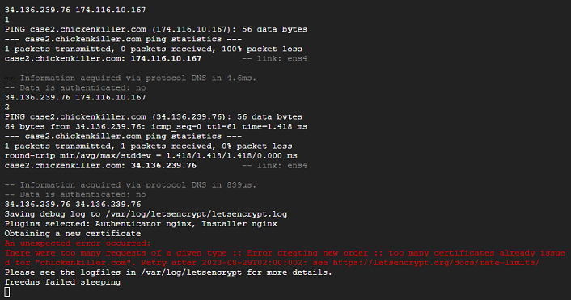

## Unexpected error - Too many requests of a given type
[Google Cloud Nightscout](./GoogleCloud.md) >> There were too many requests of a given type  
  
  

If you encounter this error while running install Nightscout phase 2, it means that installation cannot be completed for the domain you have attempted to use.  
But, this is only temporary.  

You can create a subdomain on another domain without deleting the one that failed.  You can have a total of 5 different subdomains in your FreeDNS account for free.  

In 24 hours or more, you can try again if you really like to use the original domain that failed.  Eventually, you will be able to complete the installation without an error.  
Or, you can just keep using your new hostname and forget about the original that failed.  
  
