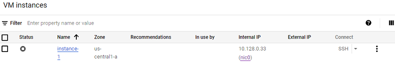

## Google Cloud Nightscout Troubleshooting
[Google Cloud Nightscout](./GoogleCloud.md) >> Troubleshooting  
  
Let's start from scratch and go over everything that could have gone wrong.  
  
Go to [Google Cloud](https://cloud.google.com/).  Sign into Google.  
Click on Console.  
  
  
Go to dashboard.  
  
  
Select "Compute Engine".  
  
  
You should see something like what is shown below with a checkmark under status.  
  
  
But, if you see something like what is shown below with a square symbol (stop) under status, it means your virtual machine has stopped.  
  

Always start by checking the [status page](./Status.md).  
  
