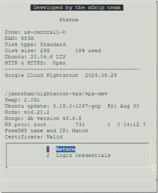

## Google Cloud Nightscout Troubleshooting
[Google Cloud Nightscout](./GoogleCloud.md) >> Troubleshooting  
  
Let's start from scratch and go over everything that could have gone wrong.  
   
  
---  
  
#### **Stopped virtual machine**  
Go to [Google Cloud](https://cloud.google.com/).  Sign into Google.  
Click on Console.  
  
  
Go to dashboard.  
  
  
Select "Compute Engine".  
  
  
You should see something like what is shown below with a checkmark under status.  
  
  
But, if you see something like what is shown below with a square symbol (stop) under status, it means your virtual machine has stopped.  
  
  
If you see that, please click on the 3-dot drop-down menu and select "Start".  
  
   
   
  
---  
  
#### **10GB disk**  
If you created your virtual machine a long time ago and never updated, you may still have a 10GB disk.  Please follow [these instructions](./FullDisk.md) to address that.  
   
   
  
---  
  
#### **Dormant FreeDNS**  
Go to [status page](./Status.md).  
  
If it shows FreeDNS name and IP mismatch and invalid certificate, as shown in the following figure, it is very likely that your FreeDNS account has gone dormant.  
  
  
In that case, please follow [these instructions](./FreeDNS_Min_Login.md) to solve the problem.  
   
   
  
---  
  
#### **Old setup**  
If your status page looks different than what is shown below, you should [update your setup](./NS_SyncExecutables.md).  
  
  
  
