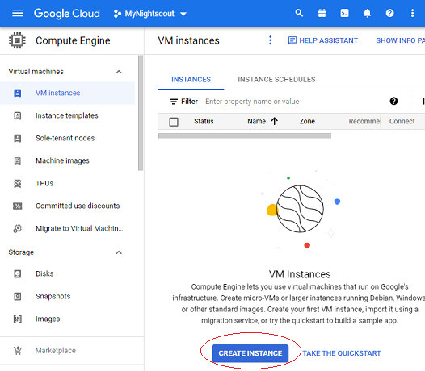

## Virtual Machine  
[xDrip](../../README.md) >> [Features](../Features_page) >> [Nightscout](../Nightscout_page) >> [Nightscout on Google Cloud](./GoogleCloud) >> Virtual Machine  
  
Here, we will create a free virtual machine in our [Google project](./NS_GCProject).   
  
Go to dashboard.  Select "Compute Engine".  Select the "VM instances" tab in the left pane if it's not already selected.  
Select "Create Instance".  
  
  
Set name to whatever you like.    
  
Set machine type to "e2-micro".  
Select a region that qualifies for free tier.  
Pay special attention to the settings marked with stars (in the images below) as they can affect cost and you will not be able to change them after you create the machine unless you delete and recreate the machine.  
  
  
Edit "Boot Disk" and modify as shown below.  Click on "Select".  
Pay attention to the marked settings as they can affect cost and you will not be able to change them later.  
  
  
Under firewall, enable both http and https.  
  
  
You will not be able to change any of this after you create.  The only way to change is to delete the machine and create a new one.  Therefore, before clicking on create, make sure all requirements listed in the following table are met.  
  
| Parameters | Requirements | Why |  
| ---------- | ------------ | ---- |  
| Machine Region    | Oregon, Iowa or South Carolina | Free Tier |  
| Machine Type | e2-micro | Free Tier |  
| Disk type    | persistent disk | Free Tier |  
| Disk size   |  Less than or equal to 30GB | Free Tier |  
| Operating system | Ubuntu | Guide consistency |  
| Version | 20.04 LTS Minimal x86 /64, amd64 ... | Nightscout compatibility |  
| Firewall | Allow HTTP traffic | Nightscout access |  
| Firewall | Allow HTTPS traffic | Nightscout access |  
  
The estimate shown at the top right on the same page will not be 0.  As long as you satisfy the conditions listed in the above table, it's OK.  You can ignore that non-0 estimate.  
Click on "Create" to create the virtual machine.  Google will now bring up your virtual machine.  Wait for it to come up.  When the external IP column appears, you should be good to go.  
  
