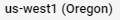

## Google Cloud Virtual Machine  
[Google Cloud Nightscout](./GoogleCloud.md) >> Virtual Machine  
  
### WARNING!  
The virtual machine you create here is only meant to be used for hosting your Nightscout.  
You should not use it for banking, trading, development, writing, shopping, web browsing or any other activity you may use your physical computer for.  
   

Here, we will create a free virtual machine in our [Google project](./NS_GCProject.md).  There is also a (silent) video clip on this page that may be helpful if the instructions are not clear.  
You will need 10-20 minutes to complete this.  
  
Go to dashboard.  Select "Compute Engine".  Select the "VM instances" tab in the left pane if it's not already selected.  
  
Select "Create Instance".  
  
  
Set name to whatever you like.  Select all the items mentioned below and marked in the images as specified (those marked with stars affect cost).  Leave everything else as is.  
  
Select a region that qualifies for free tier.  Those are ,  or .  
Set machine type to "e2-micro".    
  
  
Edit "Boot Disk" and modify as shown below.  
  
  
Click on "Select".    
  
Under firewall, enable both http and https.  
  
  
Click on "Create" to create the virtual machine.  Google will now bring up your virtual machine.  Wait for it to come up.  It could take a minute.  When the external IP column appears, you should be good to go.  
  
<video width="400" controlsList="nodownload" src="./video/VM.mp4" controls>  
</video>  
  
   
  
---  
    
You will not be able to change any of this after you create.  The only way to change is to delete the machine and create a new one.  Therefore, before clicking on create, make sure all requirements listed in the following table are met.  
  
| Parameters | Requirements | Why |  
| ---------- | ------------ | ---- |  
| Machine Region    | Oregon, Iowa or South Carolina | Free Tier |  
| Machine Type | e2-micro | Free Tier |  
| Disk type    | persistent disk | Free Tier |  
| Disk size   |  Less than or equal to 30GB | Free Tier |  
| Operating system | Ubuntu | Compatibility |  
| Version | 20.04 LTS Minimal x86 /64, amd64 ... | Nightscout compatibility |  
| Firewall | Allow HTTP traffic | Nightscout access |  
| Firewall | Allow HTTPS traffic | Nightscout access |  
  
The estimate shown at the top right on the same page will not be 0.  As long as you satisfy the conditions listed in the above table, it's OK.  You can ignore that non-0 estimate.  
You can also use the [calculator](https://cloud.google.com/products/calculator) to confirm the price.  
  
  
After you create, if you see a red exclamation mark and hovering the cursor over it shows a message (shown below) noting that a virtual machine is unavailable, you will need to dismiss the request by clicking on the garbage can symbol on the right.  Then, try to create the machine in a different region.  Unfortunately, you will need to make all the selections again for a new request.    
  
  
<video width="400" controlsList="nodownload" src="./video/VM.mp4" controls>  
</video>    
  
