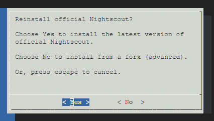
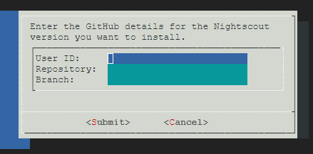

## Update/Customize Nightscout
[xDrip](../../README.md) >> [Features](../Features_page.md) >> [Nightscout](../Nightscout_page.md) >> [Google Cloud](./GoogleCloud.md) >> Update  
  
You need to have completed the [installation](./GoogleCloud.md) steps before using this utility.  
By default, it will install the latest release of official Nightscout.  
But, you can also choose to install from a GitHub fork.  
  
During the process, which takes about 25 minutes, your Nightscout will not be operational.  If you need Nightscout for a loop, please create an alternative session and switch to it while updating the other.  
  
[Update](./NS_SyncExecutables.md) executables to the latest release.  
  
Open the [terminal](./Terminal.md)    
Copy and paste the following into the terminal and enter.  
  
<mark></mark>
<mark>sudo /srv/nightscout-vps/update_nightscout.sh</mark>  
  
In a minute, the following dialog will show.  
  
  
You need to use the keyboard, not the mouse.  Use the arrow keys to move the cursor and enter to choose.  
If you want to update Nightscout, choose Yes.  It will update Nightscout from the official repository.  
If you want to install Nightscout from a fork (Advanced), choose No.  
If you have changed your mind and want to cancel, press the escape key.  If you proceed, Nightscout will stop and will not come back up until the process is completed, in about 25 minutes.  
  
If you proceed, you will see progress in the terminal for a while.  Then, you will see no change in the terminal for 20 minutes.  You need to be patient.  
  
After installation is complete, the virtual machine will reboot.  Your terminal will show an error.  This is expected.  Wait a minute and Nightscout will come up.  You can close the terminal.  
   
   
  
---  
  
#### **Customization**  
You can install Nightscout from a fork if you need to customize Nightscout.  
You should not do this if all you intend to do is to update Nightscout.  
If you choose No on the first dialog presented to you, after a minute, you will be presented with the following dialog.  
  
  
Enter the user ID, repository name and branch name to install from.  You can use the arrow keys to move the cursor to different fields.
Then, use tab to move the cursor to Submit or cancel.  
  
After submitting, Nightscout will be installed from the fork you have selected.  
The installation will take about 25 minutes.    
  
  
