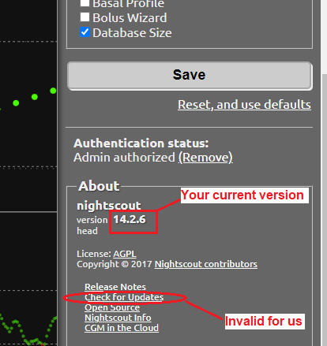

## Update Nightscout
[Google Cloud Nightscout](./GoogleCloud.md) >> Update Nightscout  
  
To see what version of Nightscout you currently have, open Nightscout in a browser, click on the (hamburger) menu button, and scroll down to the "About" section, where you can see the Nightscout version.  You can also see "Check for updates".  However, that is not a valid option for us.  
  
  
To check if any updates are available, look at the "Installation" heading on the [Google Cloud Nightscout](./GoogleCloud.md) web site.  What follows, in parentheses, is the version of Nightscout a fresh installation will provide.  If the version you have is older, you can easily update as explained below.  
  
You need to have completed the Nightscout [installation](./NS_Install.md) steps before attempting to update.  
   

---  

#### **How to update**  

You must complete all the steps listed below in sequence.  
  
1- Follow these [instructions](./NS_SyncExecutables.md) to update your virtual machine setup to the latest.  
  
2- From the Google Cloud setup submenu, select "Install Nightscout phase 1" and enter.  

3- After completion, reboot the server.  
  
Nightscout is now updated.  
   

---  

#### **What if no update is available?**  
  
When a new version of Nightscout is released, we will need to install it on Google Cloud to verify that the installation succeeds.  We then need to test it to verify that it is functional in our setup.  We may need to change the packages we install in Linux in order to be able to install the new release.  
Only after everything is tested, will we release an updated installation routine.  At that point, the version noted on the Google Cloud Nightscout page will be updated to reflect the new release, and you will be able to use the method mentioned above to update.  
  
Therefore, there will be times (right after a new Nightscout version is released) when you will not be able to use the method mentioned above to update.  
In that case, the best course of action is to be patient, for a few days, until we complete our verification and release.  
You can [inform us](./GCNS_Support.md) just in case.  
  
