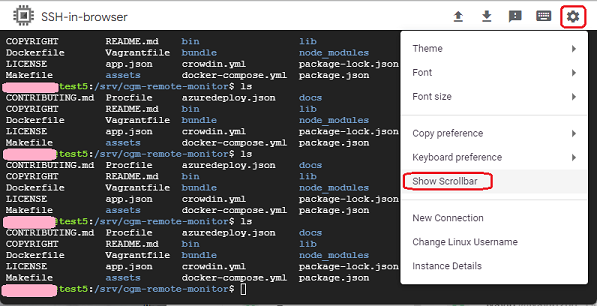

## Update Nightscout
[xDrip](../../README.md) >> [Features](../Features_page.md) >> [Google Cloud](./GoogleCloud.md) >> Update  
  
You need to have completed the [installation](./GoogleCloud.md) steps before using this utility.  
By default, it will install the latest release of official Nightscout.  
But, you can also choose to install from a Github fork.  
  
During the process, which takes 20 minutes, your Nightscout will not be operational.  And after the completion, you will need to reboot the virtual machine for Nightscout to resume operation.  
  
[Update](./NS_SyncExecutables.md) to the latest release.  
  
Open the [terminal](./Terminal.md)  
Show scrollbar on your terminal as shown below.    
  
  
Copy and paste the following into the terminal and enter.  
  
<mark>sudo /srv/nightscout-vps/update_nightscout.sh</mark>  
  
In a minute, this window will show.  
  
If nothing shows in the terminal, pay attention to the scrollbar on the side.  
You may need to scroll down in order to see the dialog.  
  
If you want to update Nightscout, choose Yes.  It will update Nightscout from the official repository.  
On the other hand, if you want to install Nightscout from a fork, choose No.  
If you have changed your mind and want to cancel, press the escape key.  If you don't and proceed, Nightscout will be shut down and will not come up until the process is completed, in about 20 minutes, and you rebbot the virtual machine.  
