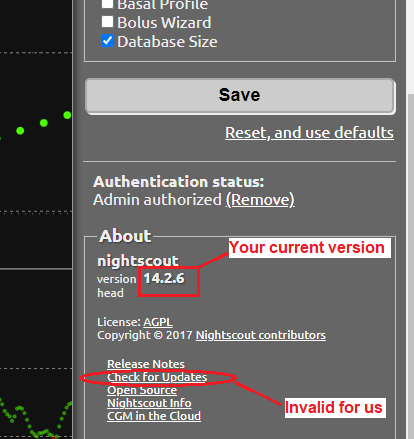

## Update Nightscout
[Google Cloud Nightscout](./GoogleCloud.md) >> Update Nightscout  
  
To check your current version of Nightscout, open Nightscout in a browser, click on the hamburger menu button, and scroll down to the "About" section. There, you will find the Nightscout version listed.  
  
  
To see if an update is available, visit the "Installation" section of the Google Cloud Nightscout website. The version mentioned in parentheses indicates the Nightscout version provided by a fresh installation or after an update. If your current version is older, you can update it using the steps outlined below.  
  
Please note that you must have already completed the initial Nightscout [installation](./NS_Install.md) steps before attempting an update.  
   
  
---  

#### **How to update**  
Follow these [steps](./NS_SyncExecutables.md) to update your virtual machine platform to the latest version.  
Once the process is complete, your Nightscout should be updated.  
   

---  

#### **What if no update is available?**  
After a new Nightscout version is released, there will be a few days when you cannot update using the usual process.  
We recommend being patient for a few days while we complete our verification and release.  
If you're unsure or need assistance, feel free to [inform us](./GCNS_Support.md).  
  
