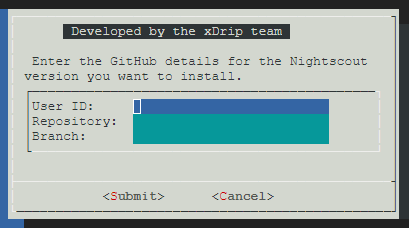

## Update Nightscout
[xDrip](../../README.md) >> [Features](../Features_page.md) >> [Google Cloud](./GoogleCloud.md) >> Update  
  
You need to have completed the [installation](./GoogleCloud.md) steps before using this utility.  
By default, it will install the latest release of official Nightscout.  
But, you can also choose to install from a GitHub fork.  
  
During the process, which takes 20 minutes, your Nightscout will not be operational.  And after the completion, you will need to reboot the virtual machine for Nightscout to resume operation.  
  
[Update](./NS_SyncExecutables.md) to the latest release.  
  
Open the [terminal](./Terminal.md)  
Show scrollbar on your terminal as shown below.    
  
  
Copy and paste the following into the terminal and enter.  
  
<mark>sudo /srv/nightscout-vps/update_nightscout.sh</mark>  
  
In a minute, this window will show.  
  
If nothing shows in the terminal, pay attention to the scrollbar on the side.  
You may need to scroll down in order to see the dialog.  
  
You can use the arrow keys to move the cursor onto Yes or No.    
If you want to update Nightscout, choose Yes.  It will update Nightscout from the official repository.  
On the other hand, if you want to install Nightscout from a fork, choose No.  
If you have changed your mind and want to cancel, press the escape key.  If you don't and proceed, Nightscout will be shut down and will not come up until the process is completed, in about 20 minutes, and you reboot the virtual machine.  
  
If you proceed, you will see progress in the terminal for a while.  Then, you will see no change in the terminal for 20 minutes.  So, you need to be patient.  
You will be presented with a choice to use an existing ceritifcation or to renew it.  Choose 1 to attempt to reinstall the existing certificate.  
Then, select 2 to redirect to secure https.  

When the prompt becomes available again in the terminal, copy and past the following into the terminal and enter to restart.  
  
<mark>sudo reboot</mark>  
  
After reboot, you will need to wait a minute for the machine to come back up.  Then, you can close the terminal and open a new one, or click on retry to reconnect.  
Nightscout should be running again now.  
   
   
  
---  
  
#### **Customization**  
You can install Nightscout from your fork.  You can customize Nightscout in your fork and use this utility to install it.  
If you choose No on the first dialog presented to you, after a minute, you will be presented with the following dialog.  
  
  
Enter the user ID, repository name and branch name to install from.  
Then, use tab to move the cursor to Submit.  
  
After submitting, Nightscout will be installed from the fork you have selected.  
It will take about 20 minutes.  After completion, you will need to reboot for Nightscout to resume operation.  
  
  
