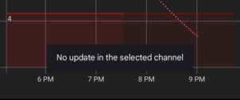

## Why nothing happens when I check for updates?
[xDrip](../README.md) >> [Features](./Features_page.md) >> [Updates](./Updates.md) >> Why nothing happens when I check for updates?  
  
xDrip only checks for updates in the update channel you have chosen.  
If there is no release in the update channel you have chosen more recent than the release you have currently installed when you check for updates, a note will appear at the bottom of the screen for a few seconds stating that as shown below.  
  
  
See [Update xDrip](./Updates.md) for details.  
  
