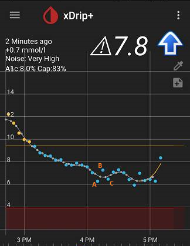

## Noise 

As a sensor ages, its accuracy diminishes, and the correlation with interstitial fluid glucose deteriorates.  
Noise is the rapid oscillatory fluctuation of readings that is due to the sensor malfunction rather than a real representation of your blood glucose.  
  
Please look at the readings in the following image.   
  
According to the readings, the blood glucose increases from reading A to the following reading marked with B.  Then, the blood glucose decreases from reading B to the following reading marked with C.  But, the time sequence between these readings is only 5 minutes.  Your blood glucose never fluctuates that fast.  
This is obviously caused by the malfunction of the sensor.  In this case, you can either switch to a new sensor or will have to put up with the ups and downs until you do. 
