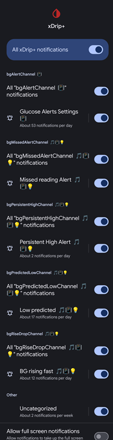
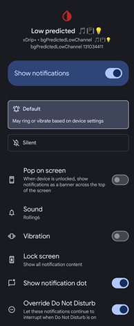

## Notification Channels  
[xDrip](../README.md) >> [Features](./Features_page.md) >> [Alerts](./Alerts_page.md) >> Notification Channels  
  
You can enable notification channels at `Settings` &#8722;> `Alarms and Alerts` &#8722;> `Glucose Alerts Settings` &#8722;> `Notification Channels`.  
If you do, every alert will create a new Android notification channel (only on Android 8 and +) with specific settings.  
  
The following shows xDrip notification channel list on my phone at `Android Settings` &#8722;> `Apps` &#8722;> `xDrip+` &#8722;> `Notifications`.  
  
  
You can edit the settings of each channel, by tapping on the item corresponding to the channel on the left side of the vertical line.  This will allow you to customize the notification behavior.  
The following shows the corresponding Forecast Low alert settings.  
  
  
Please note that if there is a discrepancy between a setting in xDrip and in the Android notification channel settings, Android settings will take effect.  For example, if you enable override silent mode in xDrip for an alert, but disable override do not disturb for the corresponding notification channel, your alert will not be heard when your phone is in DND.  
  
There is a known [bug](https://github.com/NightscoutFoundation/xDrip/issues/1503) that results in some channels missing editable settings on some Android 11 phones.  
  
