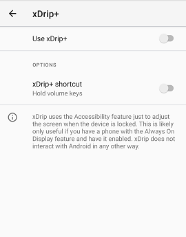

## Why doesn't Number wall on lock screen disable?  
  
If you have disabled Number wall on lock screen, but it still appears, make sure to disable xDrip under Android Accessibility as shown below.  
  
    
