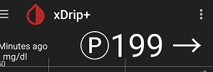

# Encircled P
[xDrip](../) >> [FAQ](./FAQ_page.md) >> Encircled P in front of the reading  
  
  
  
An encircled P is shown in front of the blood glucose reading on the main screen if the following two conditions are satisfied.  
  
1- A plugin is used.  This is enabled at Settings &#8722;> Less common settings &#8722;> Advanced Calibration &#8722;> Use Plugin Glucose.  
2- The Calibration plugin is not null.  This is done by choosing anything other than None at Settings &#8722;> Less common settings &#8722;> Advanced Calibration &#8722;> Calibration Plugin.  
