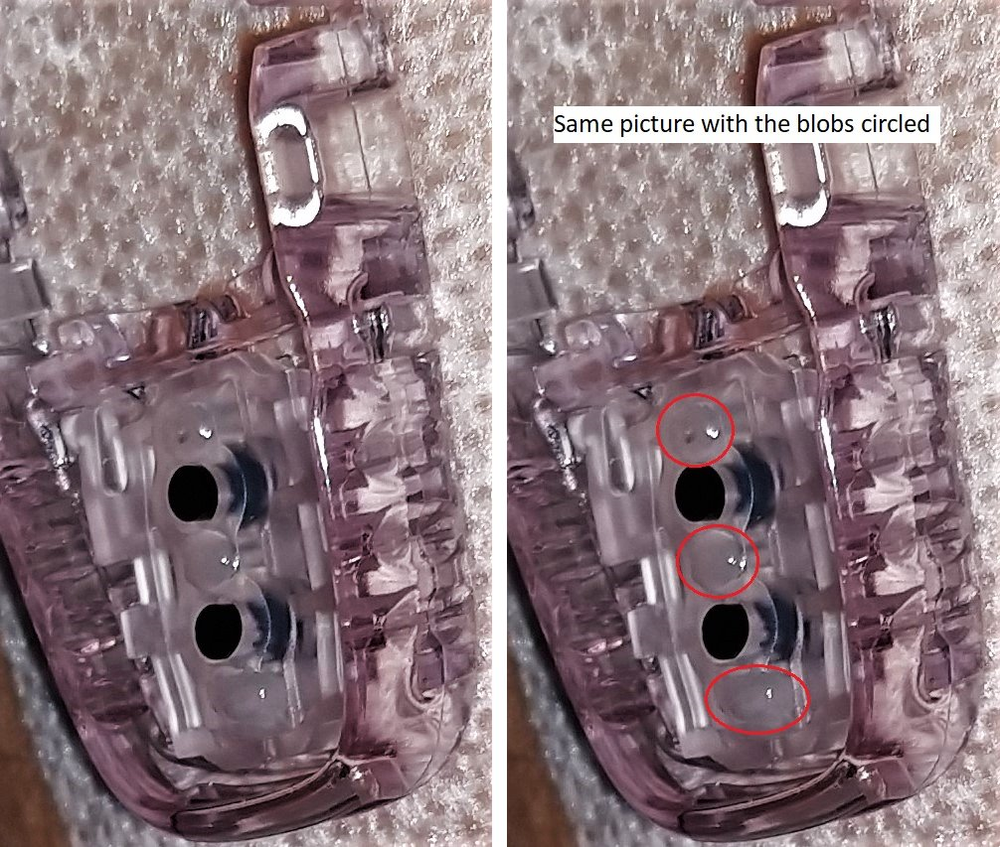
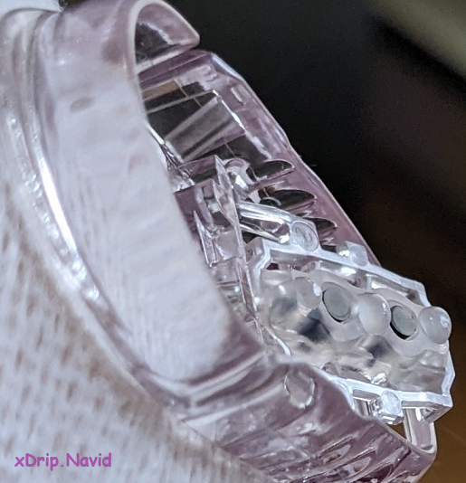
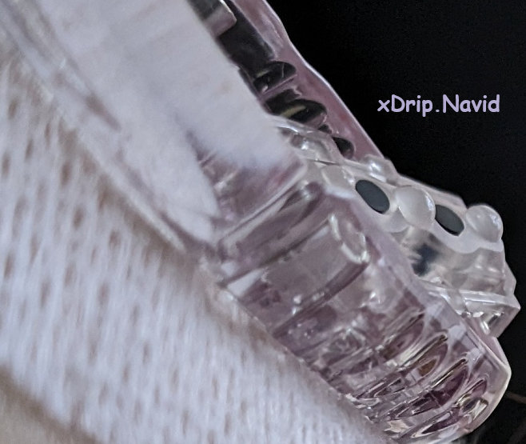
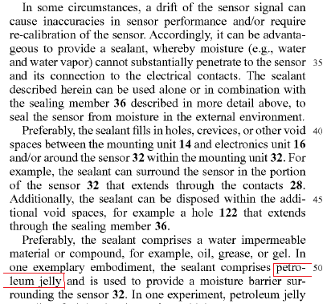
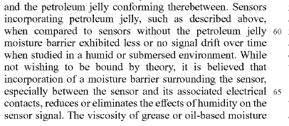

## Petroleum Jelly in Dexcom G6 Sensor
[xDrip](../README.md) >> [Features](./Features_page.md) >> [xDrip & Dexcom](./Dexcom_page.md) >> Petroleum jelly  
  
After inserting the sensor and before snapping in the transmitter, you may notice small blobs of petroleum jelly inside the sensor around the contacts.  
**Do not wipe them off.**  Also, ensure that dust or any other material does not get into the sensor.  
  
Wait a minute or two to ensure there is no bleeding. If bleeding occurs, use Q-tips to absorb the blood and continue until the bleeding stops. If blood gets into the contacts, it may compromise their insulation, leading to erroneous low readings.  
  
After cleaning the transmitter contacts (but not the sensor), snap in the transmitter. This action spreads the petroleum jelly around the contacts, forming a barrier against moisture.  
  
To [restart a G6 sensor](./Restart-G6-sensor.md), the transmitter is removed and later snapped back in. Do not insert a test strip between the transmitter and the sensor to restart it. Doing so may effectively wipe away the petroleum jelly.  
When [removing the transmitter for a restart](./Remove-transmitter.md), avoid wiping away the substance from the transmitter contacts. While the transmitter is out, keep the contacts untouched. Also, avoid wearing tight clothing over the sensor to prevent wiping away the petroleum jelly.  

  
   

  

  
   

---  

#### **Dexcom Patent**  
The following snapshot is from a Dexcom patent. It describes a potential problem and suggests petroleum jelly as an optional solution.   
  
  
   
  
The second snapshot below highlights the advantages of using petroleum jelly.  

  
  
