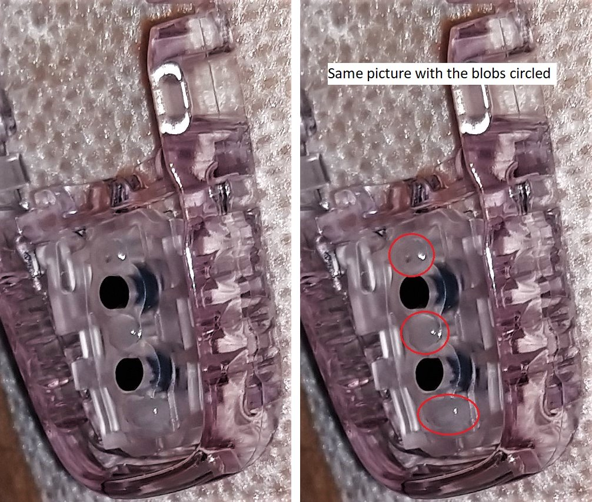
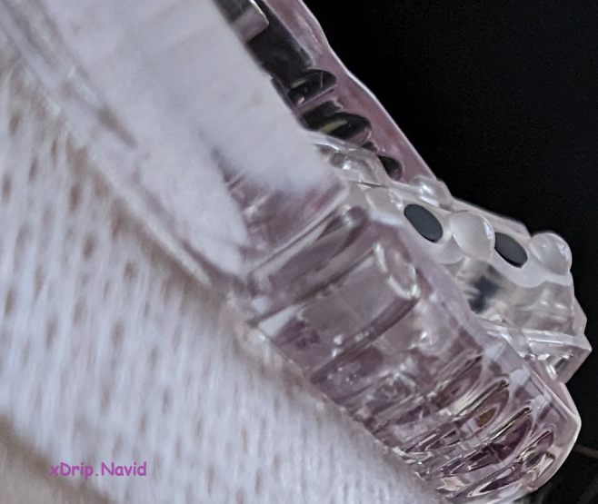

## Petroleum Jelly in Dexcom G6 Sensor
[xDrip](../README.md) >> [Features](./Features_page.md) >> [xDrip & Dexcom](./Dexcom_page.md) >> Petroleum jelly  
  
After inserting the sensor and before snapping in the transmitter, you can see small blobs of petroleum jelly inside the sensor around the contacts.  
Don't wipe them off. Don't let dust or any other material get into it.  

You should wait a minute or two to make sure there is no bleeding. If there is, use Q-tips to absorb the blood and keep doing it until bleeding stops. If blood gets into the contacts, it could compromise the insulation of the two contacts resulting in erroneous low readings.  

After cleaning the transmitter contacts (not the sensor) snap in the transmitter. Doing so causes the substance to spread around the contacts. It provides a barrier, against moisture, around the contacts.  

In order to [restart](./Restart-G6-sensor.md) a G6 sensor, we remove the transmitter and later snap it back in. Don't insert a test strip between the transmitter and sensor to restart.  Doing so will effectively wipe away the jelly.  
When [removing the transmitter for restart](./Remove-transmitter.md), don't wipe away the substance from the transmitter contacts. While the transmitter is out, keep the contacts untouched and avoid wearing tight clothing over the sensor to avoid wiping away the substance.  

  
   

  

  

  
