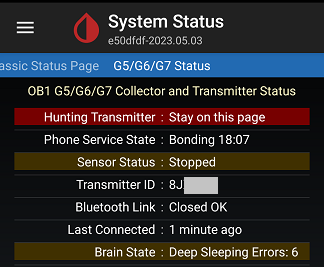
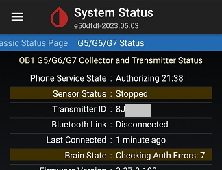

## Transmitter Bluetooth Connectivity  
[xDrip](../README.md) >> [Features](./Features_page.md) >> [xDrip & Dexcom](./Dexcom_page.md) >> xDrip and Dexcom Proper Connectivity  
  
Dexcom operates a sample-and-hold system. Data updates occur every 5 minutes, with no changes in between. xDrip reflects what Dexcom reports once every 5 minutes. If you make a change, you will need to wait for the next connection cycle (every 5 minutes) to see the updates. This process may take even longer. For example, if you tap "Stop Sensor," the command will be queued and shown on the status page. On the next reading, the transmitter will receive the request. However, the transmitter will not acknowledge that it has stopped until after the 5-minute update. Therefore, you will see confirmation on the status page only after waiting an additional 5 minutes.  
  
Please be patient and allow the sample-and-hold system to operate and update. Avoid checking the status page too frequently to understand changes.  
   
  
---  
  
#### **Connectivity**  
Go to the Dex status page.  
  
   
  
Connectivity is considered OK if the following conditions are met:  
- There is a line starting with “Last Connected:”.  
- The “Last Connected” value is less than 5 minutes, as long as you stay near the phone.  
- With consecutive read cycles (5 minutes each), the “Last Connected” value should gradually increase and roll back to 0 just before reaching 5 minutes every cycle.  
- No messages like "Hunting Transmitter," "Scanning Error," "Waiting Connect Errors," "Checking Auth Errors," or "Deep Sleeping Errors" are displayed.  
   
  
---  
  
#### **Disconnect**  
A disconnect is indicated if any of the conditions mentioned above are not met. A disconnect is also indicated by messages such as “Deep Sleeping Errors” or “Checking Auth Errors” on the status page.   
  
  
  
  
If there is a connectivity issue, [resolve it](./Connectivity-troubleshoot.md) before issuing any commands (e.g., start, stop, calibrate, hard reset).  
  
