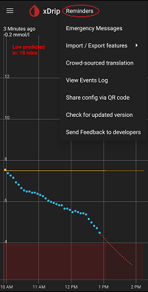

## Reminders  
  
To enable reminders, enable Settings &#8722;> xDrip+ Display Settings &#8722;> Enable Reminder features.  
  
After enabling Reminders, after an xDrip restart (just minimize and reopen), you can access them under the top right (3 dot) menu.  
  
